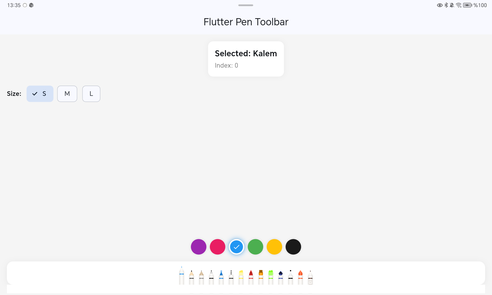
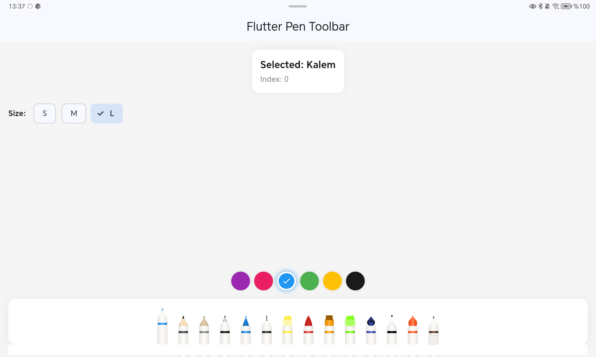

# Flutter Pen Toolbar

A beautiful, customizable pen toolbar widget for Flutter drawing applications. Features 14 realistic pen types with smooth selection animations and flexible configuration options.

[](https://pub.dev/packages/flutter_pen_toolbar)
[](https://opensource.org/licenses/MIT)

<p align="center">
  
</p>

## Features

- 🖊️ **14 Pen Types** - Pen, Pencil, Ballpoint, Gel Pen, Fountain Pen, Brush, Marker, Highlighter, and more
- 🎨 **Customizable Colors** - Each pen can have its own color with automatic stripe and tip coloring
- ✨ **Smooth Animations** - Beautiful selection animations with configurable duration and curves
- 📐 **Flexible Sizing** - Small, medium, large presets or fully custom dimensions
- 🔒 **Enable/Disable** - Individual pens can be enabled, disabled, or hidden
- 💡 **Tooltips** - Optional tooltips for each pen
- 🎯 **Zero Dependencies** - Only Flutter SDK required

## Preview

| Default | Small | Large |
|---------|-------|-------|
|  |  |  |

## Installation

Add this to your package's `pubspec.yaml` file:

```yaml
dependencies:
  flutter_pen_toolbar: ^1.0.0
```

Or install via command line:

```bash
flutter pub add flutter_pen_toolbar
```

## Quick Start

```dart
import 'package:flutter_pen_toolbar/flutter_pen_toolbar.dart';

class MyDrawingPage extends StatelessWidget {
  @override
  Widget build(BuildContext context) {
    return Scaffold(
      body: Column(
        children: [
          Expanded(child: MyCanvas()),
          PenToolbar(
            pens: [
              PenToolbarItem(type: PenType.pen, color: Colors.black),
              PenToolbarItem(type: PenType.pencil, color: Color(0xFF4A4A4A)),
              PenToolbarItem(type: PenType.highlighter, color: Colors.yellow),
              PenToolbarItem(type: PenType.marker, color: Colors.red),
            ],
            onPenSelected: (index) {
              print('Selected pen: $index');
            },
          ),
        ],
      ),
    );
  }
}
```

## Pen Types

| Type | Description | Preview |
|------|-------------|---------|
| `PenType.pen` | Classic sharp tip pen | 🖊️ |
| `PenType.pencil` | Wooden pencil with graphite tip | ✏️ |
| `PenType.pencilTip` | Mechanical pencil style | ✏️ |
| `PenType.ballpointPen` | Ballpoint with metal tip | 🖊️ |
| `PenType.gelPen` | Smooth gel pen | 🖊️ |
| `PenType.dashedPen` | For dashed lines | ✒️ |
| `PenType.highlighter` | Transparent highlighter | 🖍️ |
| `PenType.neonHighlighter` | Glowing neon effect | 🖍️ |
| `PenType.brushPen` | Brush tip for calligraphy | 🖌️ |
| `PenType.marker` | Flat tip marker | 🖍️ |
| `PenType.fountainPen` | Classic fountain pen nib | 🖋️ |
| `PenType.fineliner` | Fine tip technical pen | ✒️ |
| `PenType.crayon` | Wax crayon | 🖍️ |
| `PenType.rulerPen` | For straight lines (with ruler marks) | 📏 |

## Configuration

### Size Presets

```dart
// Small toolbar
PenToolbar(
  pens: pens,
  config: PenToolbarConfig.small,
);

// Medium (default)
PenToolbar(
  pens: pens,
  config: PenToolbarConfig.medium,
);

// Large toolbar
PenToolbar(
  pens: pens,
  config: PenToolbarConfig.large,
);

// Scale any preset
PenToolbar(
  pens: pens,
  config: PenToolbarConfig.medium.scale(1.5),
);
```

### Custom Configuration

```dart
PenToolbar(
  pens: pens,
  config: PenToolbarConfig(
    // Pen dimensions
    penWidth: 30,
    penHeight: 64,
    
    // Toolbar dimensions
    toolbarHeight: 76,
    toolbarBorderRadius: 16,
    itemSpacing: 6,
    padding: EdgeInsets.symmetric(horizontal: 12, vertical: 8),
    
    // Body styling
    bodyWidthRatio: 0.55,
    tipHeightRatio: 0.28,
    stripeHeight: 4,
    stripeTopOffset: 10,
    
    // Colors
    bodyColor: Color(0xFFF5F3F0),
    bodyColorDark: Color(0xFFE8E6E3),
    bodyColorLight: Color(0xFFFFFEFC),
    toolbarBackgroundColor: Colors.white,
    
    // Animation
    animationDuration: Duration(milliseconds: 200),
    animationCurve: Curves.easeOutCubic,
    selectedOffset: 0,
    unselectedOffset: -14,
    
    // Shadow
    toolbarShadow: [
      BoxShadow(
        color: Colors.black.withOpacity(0.1),
        blurRadius: 16,
        offset: Offset(0, 4),
      ),
    ],
  ),
);
```

### Pen Item Options

```dart
PenToolbarItem(
  type: PenType.pen,
  color: Colors.black,
  enabled: true,      // Set false to disable (grayed out)
  visible: true,      // Set false to hide completely
  tooltip: 'Black Pen', // Optional tooltip on long press
);
```

### Dynamic Color Changes

```dart
class _MyPageState extends State<MyPage> {
  final List<PenToolbarItem> _pens = [
    PenToolbarItem(type: PenType.pen, color: Colors.black),
    PenToolbarItem(type: PenType.pencil, color: Colors.grey),
  ];
  
  int _selectedIndex = 0;

  void _changeColor(Color newColor) {
    setState(() {
      _pens[_selectedIndex] = _pens[_selectedIndex].copyWith(color: newColor);
    });
  }

  @override
  Widget build(BuildContext context) {
    return PenToolbar(
      pens: _pens,
      initialSelectedIndex: _selectedIndex,
      onPenSelected: (index) {
        setState(() => _selectedIndex = index);
      },
    );
  }
}
```

### Get Pen Display Name

```dart
final pen = PenToolbarItem(type: PenType.fountainPen, color: Colors.blue);
print(pen.displayName); // "Dolma Kalem" (Turkish)
```

## Standalone Pen Widget

You can also use individual pens outside the toolbar:

```dart
PenItem(
  penType: PenType.brushPen,
  penColor: Colors.purple,
  isSelected: true,
  isEnabled: true,
  config: PenToolbarConfig.medium,
  onTap: () => print('Pen tapped!'),
);
```

## Full Example

```dart
import 'package:flutter/material.dart';
import 'package:flutter_pen_toolbar/flutter_pen_toolbar.dart';

void main() => runApp(const MyApp());

class MyApp extends StatelessWidget {
  const MyApp({super.key});

  @override
  Widget build(BuildContext context) {
    return MaterialApp(
      home: const DrawingPage(),
    );
  }
}

class DrawingPage extends StatefulWidget {
  const DrawingPage({super.key});

  @override
  State<DrawingPage> createState() => _DrawingPageState();
}

class _DrawingPageState extends State<DrawingPage> {
  int _selectedPenIndex = 0;
  int _selectedColorIndex = 0;

  final List<Color> _colors = [
    Colors.black,
    Colors.red,
    Colors.blue,
    Colors.green,
    Colors.orange,
    Colors.purple,
  ];

  final List<PenToolbarItem> _pens = [
    PenToolbarItem(type: PenType.pen, color: Colors.black),
    PenToolbarItem(type: PenType.pencil, color: Colors.black),
    PenToolbarItem(type: PenType.ballpointPen, color: Colors.black),
    PenToolbarItem(type: PenType.gelPen, color: Colors.black),
    PenToolbarItem(type: PenType.highlighter, color: Colors.yellow),
    PenToolbarItem(type: PenType.brushPen, color: Colors.black),
    PenToolbarItem(type: PenType.marker, color: Colors.black),
    PenToolbarItem(type: PenType.fountainPen, color: Colors.black),
  ];

  void _onColorSelected(int index) {
    setState(() {
      _selectedColorIndex = index;
      _pens[_selectedPenIndex] = _pens[_selectedPenIndex].copyWith(
        color: _colors[index],
      );
    });
  }

  @override
  Widget build(BuildContext context) {
    return Scaffold(
      backgroundColor: const Color(0xFFF5F5F5),
      body: SafeArea(
        child: Column(
          children: [
            // Canvas area
            Expanded(
              child: Container(
                margin: const EdgeInsets.all(16),
                decoration: BoxDecoration(
                  color: Colors.white,
                  borderRadius: BorderRadius.circular(12),
                  boxShadow: [
                    BoxShadow(
                      color: Colors.black.withOpacity(0.05),
                      blurRadius: 10,
                    ),
                  ],
                ),
                child: const Center(
                  child: Text('Drawing Canvas'),
                ),
              ),
            ),

            // Color picker
            Padding(
              padding: const EdgeInsets.symmetric(horizontal: 24, vertical: 8),
              child: Row(
                mainAxisAlignment: MainAxisAlignment.center,
                children: List.generate(_colors.length, (index) {
                  final isSelected = index == _selectedColorIndex;
                  return GestureDetector(
                    onTap: () => _onColorSelected(index),
                    child: Container(
                      width: 32,
                      height: 32,
                      margin: const EdgeInsets.symmetric(horizontal: 4),
                      decoration: BoxDecoration(
                        color: _colors[index],
                        shape: BoxShape.circle,
                        border: isSelected
                            ? Border.all(color: Colors.white, width: 3)
                            : null,
                        boxShadow: [
                          if (isSelected)
                            BoxShadow(
                              color: _colors[index].withOpacity(0.5),
                              blurRadius: 8,
                            ),
                        ],
                      ),
                    ),
                  );
                }),
              ),
            ),

            // Pen toolbar
            Padding(
              padding: const EdgeInsets.all(16),
              child: PenToolbar(
                pens: _pens,
                initialSelectedIndex: _selectedPenIndex,
                onPenSelected: (index) {
                  setState(() => _selectedPenIndex = index);
                },
              ),
            ),
          ],
        ),
      ),
    );
  }
}
```

## Contributing

Contributions are welcome! Please feel free to submit a Pull Request.

## License

This project is licensed under the MIT License - see the [LICENSE](LICENSE) file for details.

## Author

**İlyas Boz** - [GitHub](https://github.com/aktasilyas)

---

<p align="center">
  Made with ❤️ for Flutter developers
</p>